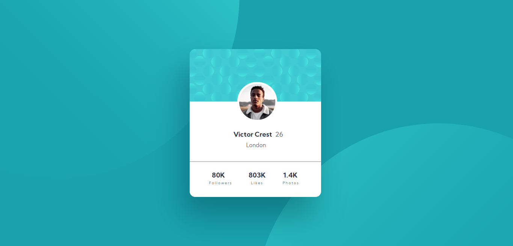
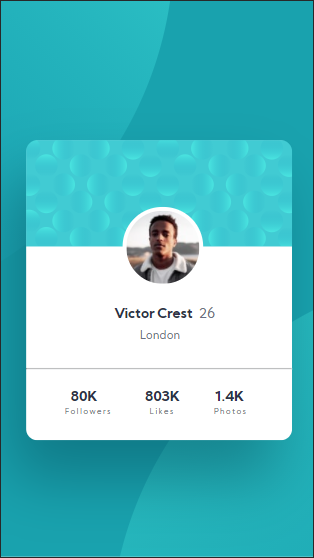

# Frontend Mentor - Profile card component solution

This is a solution to the [Profile card component challenge on Frontend Mentor](https://www.frontendmentor.io/challenges/profile-card-component-cfArpWshJ). Frontend Mentor challenges help you improve your coding skills by building realistic projects.

## Table of contents

- [Overview](#overview)
  - [The challenge](#the-challenge)
  - [Screenshot](#screenshot)
  - [Links](#links)
- [My process](#my-process)
  - [Built with](#built-with)
  - [Deploy to](#deploy-to)

## Overview

### The challenge

Your challenge is to build out this profile card component and get it looking as close to the design as possible.

You can use any tools you like to help you complete the challenge. So if you've got something you'd like to practice, feel free to give it a go.

### Screenshot

#### Desktop

#### Mobile

### Links

- Solution URL: [GitHub](https://github.com/jojomanurung/ProfileCard#overview)
- Live Site URL: [My-Profile-Card-FEM](https://my-profile-card-fem.netlify.app/)

## My process

### Built with

- Semantic HTML5 markup
- CSS custom properties
- Mobile-first workflow
- Bootstrap 5

### Deploy to

- [Netlify](https://netlify.com)
